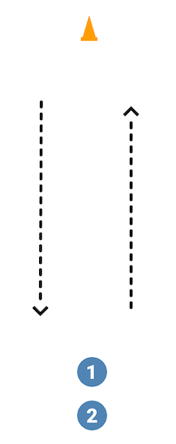
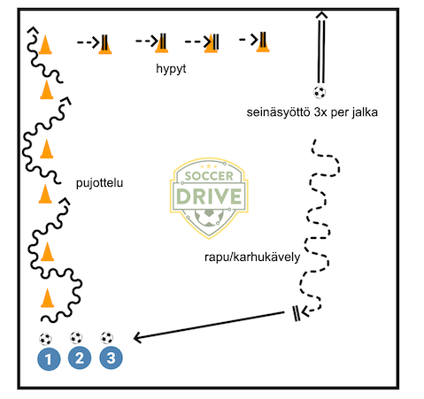
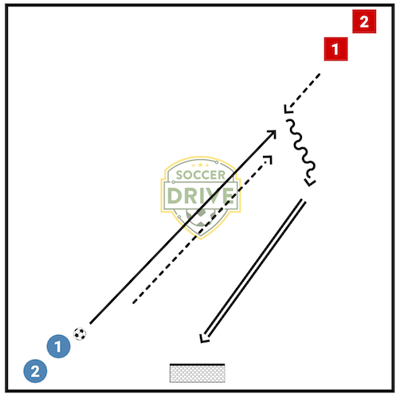

Ideoita ja inspiraatiota Blingin reeneihin ⚽️🥅🏋️‍♀️

## Ellin reeni 1

* **Laji**: Futsal
* **Osallistujat**: 6
* **Alkulämpö**: **Kolmen maalin peli**
  * Kaksi joukkuetta, tehdään tötsistä kolme pientä maalia.
  * Yritetään tehdä maali (suoraan syötöstä).
  * Viimeksi yritettyyn maaliin (vastustajan tai oman joukkueen)  ei saa tehdä maalia.
* **Reenit**:
  * **Kuljetukset eri tyyleillä** (kolme jonoa, tötsä kääntöpaikalle)
      * Sisäsyrjillä eteenpäin ↶ taaksepäin
      * Jalkapohjilla eteenpäin ↶ taaksepäin
      * Saman jalan jalkapohjalla eteenpäin ↶ toisella jalalla
      * Pallon pyöräytys sivuttain ↶ toisella jalalla
      * Pallon pyöräytys ja pysäytys sivuttain ↶ toisella jalalla
      * Yhdellä jalalla vuoroin sisä- vuoroin ulkosyrjä ↶ toisella jalalla

      
      ***
  * **Kiusataan possua keskellä** (kolme pelaajaa, kaksi tötsää keskellä)
      * Keskellä olevan syöttää päätyyn, saa syötön takaisin, harhauttaa tötsät ja syöttää toiseen päätyyn, saa syötön takaisin jne.
      * Vaihdetaan jonkin ajan jälkeen niin että kaikki kolme pelaajaa käyvät keskellä.
      
      ***

## Ellin reeni 2

* **Laji**: Futsal
* **Osallistujat**: 9
* **Reenit**:
  * **Temppurata**:
    * Pujotellaan tötsät, ensimmäinen kierros kahdella jalalla, sitten yhdellä
    * Päädyssä hypyt pallo jalkojen välissä tötsien yli
    * Potkaistaan seinään pallo ilmassa mahdollisimman korkealle, haltuunotto. 3 x per jalka
    * Karhukävely palloa palloa potkien takaisin. Toisella kierroksella rapukävely.
    * Syöttö jonoon.
    
    ***
  * **Pakki menettää pallon**
    * Kaksi jonoa, pallot maalin vieressä pakeilla
    * Pakki syöttää hyökkääjälle ja lähtee hyökkääjää vastaan
    * Pakki peittää, hyökkääjä yrittää harhauttaa ja tehdä maalin
    
    ***

